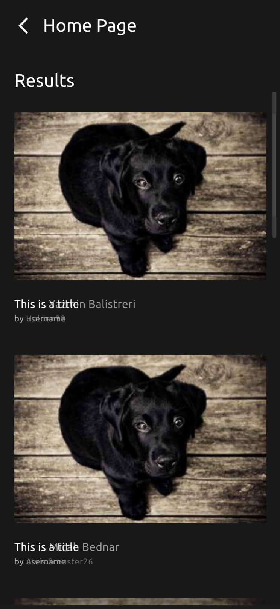

## Aha - Exam 2

*Built with [NextJS](https://nextjs.org/) and [TailwindCSS](https://tailwindcss.com/).*


### How to run

Install dependencies

```
npm i
```
To run locally

```
 npm run dev
```

To create and run the production build

```
npm build && npm run start
```

Navigate to [http://localhost:3000]([http://localhost:3000/)

### Deployment URLs

There are two URLs. One has a build that has been slowed down purposefully to allow those reviewing the app to see the loading animations and skeleton placeholders, given that the API the app is integrated with returns results quite fast possibly making it hard to see any loading states. Both URLs are listed below.

>**No slow downs**
https://aha-nine.vercel.app/

>**With slow downs**
https://aha-csmartinsfct.vercel.app/

The version with slow downs has these operations slowed down:

- Fetching of results, social and tags.
- Displaying of images (in the Results Page and Social UI)


### Global state management

Global state management is achieved via React context, with the help of a reducer. You can find the files here. The global state holds the data for:

Home page:

- pageSize (used in Slider)
- keyword (used in Input)

Results page:

- the data to be displayed
- current API page
- total number of pages in the API

Social page:

- the data to be displayed
- current API page
- total number of pages in the API

Tags page:

- the data to be displayed

The thunks used to fetch data from the API and dispatch further actions can be found here.


> _Note_: for this app the global state could have been split, since there is no intersection between any of the data sets being held in the global state (Social, Search Results and Tags.).
>
> Having the data sets together this way creates a re-render issue where if the user is typing in the input or updating the slider or using the infinite scrolling functionality while in the Results page the Social UI will re-render on context updates and vice-versa. To ensure no unnecessary re-renders happen due to this decision both the Social UI and Search Results UI and Home are wrapped in the memo function.
>
> The decision of having the global state hold all 3 data sets this way was just to reduce the code boilerplate for this exam.


#### Pixel perfect implementation

Pixel perfect implementation was a requirement for this exam and although I tried to comply with it I've found some roadblocks, which I will list below. Please note all the screenshots below are composed of two layers, mine on top with 30% opacity and the Figma one below it, unless said otherwise (like in the example below - the Sidebar bug).

**Sidebar bug**

There are mismatching sidebars in the Figma mockup, for example the one in the Tags page doesn't match the one in the Home page, see comparison below. _For the implementation, the sidebar in the Tags screen was used (desktop only)_.


As you can see, the icons are a few pixels off from each other, while the logo is in the same position in both screens.

**Sidebar on desktop**

In Figma the sidebar icon that isn't selected does not have a label - considering this breaks good practices concerning accessibility and also makes it otherwise impossible to know what the icon is for (making for possibly a bad UX) I left the labels for the icons visible at all times. This was based on a note in the google docs that mentions anything found to be ambiguous should be dealt with to provide the best UX for the end-user. I should also add the icons are identical so they don't even suggest what page the user may go to.

**Sidebar/Navbar on mobile**

My implementation differs from the one in Figma in 3 things:

1) It keeps the icon labels for the same reason as mentioned above.
2) It has a link to the Social page. It was ambiguous to me that there is a mock in Figma for how the Social page should look on mobile but no way to access it looking at the mock as there are only two icons, one for the Home page and another for the Tags page. So I added another one so the user can access the Social page on mobile as well.
3) There is a background effect in the Sidebar that can't be directly extracted from Figma, this is something where I'd usually talk to the designer directly so they can tell me how they did it or else, as I did here, try to get close to displaying the same effect. Considering that in this case there is a lot of trial and error involved in getting the desired effect I left it close to what the mock displays.

**Tag label**

In Figma the tag `Beautiful` fits within the rectangle without it requiring ellipsis. I could not achieve this while keeping the rectangle pixel perfect (it is off by 1px on the right). As you'll see below the word `Cool` is pixel perfect and so will other words be, the word `Beautiful` didn't fit and that bothered me so I took the liberty to leave the implementation not pixel perfect in this case. It should be noted the spacing used in the mockup is subjectively uneven. Using the word `Beautiful` as an example, the rectangle has less space on its right then on its left, which subjectively may not be the best approach design-wise.


##### Pixel perfect implementation - screenshots

To reiterate what was said above, each screenshot is composed of two layers, mine on top at 30% opacity and the Figma one below.

As far as screen resolutions, for Mobile the resolution of 375px x 812px was used and for Desktop 1440px x 900px. The UI is responsive while being pixel perfect at the aforementioned resolutions.

##### Mobile

###### Home


_[High res image](./public/readme/home_mobile.png)_

_30 was added manually for the purpose of comparing screenshots, would read 15 otherwise_

###### Tags


_[High res image](./public/readme/tags_mobile.png)_

###### Results

Here for the screenshot comparisons I had to manually update the images' height to be 1px less than calculated by the browser, otherwise everything would be misaligned. I set the width and the browser sets the height keeping the aspect ratio of the image so I'm unsure of what exactly went wrong... I exported the image from Figma so it should be the same size but in Figma the height is 1px less than what gets rendered.



_[High res image](./public/readme/results_mobile.png)_

###### Social


_[High res image](./public/readme/social_mobile.png)_

##### Desktop

###### Home


_[High res image](./public/readme/home_desktop.png)_

_30 was added manually for the purpose of comparing screenshots, would read 15 otherwise_

###### Tags

Here the mockup in Figma uses "Results" for some tags and "Questions" for others, I settled in using "Results" since the API doesn't mention either and it seemed more appropriate to use "Results" vs "Questions".


_[High res image](./public/readme/tags_desktop.png)_

###### Results


_[High res image](./public/readme/results_desktop.png)_

#### Infinite Scrolling and Skeletons

These were one of the optional requirements and both were implemented. Infinite scrolling was added in the Results and Social UIs. Skeletons were added in the Results, Social and Tags UIs respectively. See the GIFs below.

###### Results


_[High res image](./public/readme/results_loading.gif)_

*No more results message upon fetching all results from the API*


_[High res image](./public/readme/results_no_more_results.png)_


###### Social


_[High res image](./public/readme/social_loading.gif)_

*No more results message upon fetching all results from the API*


_[High res image](./public/readme/social_no_more_results.png)_

###### Tags


_[High res image](./public/readme/tags_loading.gif)_

#### Follow and Unfollow

I made these operations work although the changes do not persist on page refreshes.


_[High res image](./public/readme/follow.gif)_

#### Error handling

The following error messages are displayed in case any of the requests for Results, Social or Tags fail:


_[High res image](./public/readme/results_error.png)_


_[High res image](./public/readme/tags_error.png)_


_[High res image](./public/readme/social_error.png)_


#### Bugs

As requested in the google docs, here are the bugs I'm aware of in the application:

- No error handling if an image fails to load while in the search results or in the social sidebar. The skeleton is displayed instead.
- The grid in the results page does not handle images of different sizes correctly.

#### Possible optimizations

- Images could be lazy loaded (images that are not in the viewport don’t have to be loaded).

#### Possible improvements

- A typography component would be good to have to avoid repetition across the code-base.
- Save to local storage (for example) what were the last parameters (pageSize and keyword) the user entered so we can persist those across page refreshes.
- Accessibility. Users using screen readers would have a hard time with this application.

#### Issues found in your app

- I got an error creating an account and also when I create a mock test in Practice SAT Reading, finish it, click back to Review I get the same error creating an account.


_[High res image](./public/readme/aha_no_account.png)_


- Slider doesn’t update the info above it while dragging. Only when I stop dragging does it update the number of selected questions.


_[High res image](./public/readme/aha_slider_bug.gif)_

- Slider forgets the selected value if I navigate to a different page upon selecting it and return to the page.


_[High res image](./public/readme/aha_slider_forget.gif)_

- Clicking “directions” shows an arguably bugged animation to reveal the popup. A 2-step animation versus a single smooth animation.


_[High res image](./public/readme/aha_popup.gif)_

- The Challenge Friends input, upon filling, doesn’t do anything nor shows any messages, leaving the user wondering what is happening.


_[High res image](./public/readme/aha_no_feedback.png)_

- Clicking “Notification” in the sidebar shows a “no notification yet” message at the bottom of the page as opposed to being at the top.


_[High res image](./public/readme/aha_notifications.png)_

- Changing tests (for example going from SAT to SAT UPPER) breaks the whole UI where nothing can be interacted with except for the sidebar. (On mobile the navbar also stops working)


_[High res image](./public/readme/aha_broken_on_navigation.gif)_

- The slider gradient starts with offset to the right.


_[High res image](./public/readme/aha_slider_offset.png)_

- The form to set a goal has a lot of labels and I think its hard to look at and visually navigate. Spacing could be improved there to aid with readability.


_[High res image](./public/readme/aha_goal_form.png)_

- “Choose the plan that suits you” page is not fully responsive.


_[High res image](./public/readme/aha_plan.png)_
